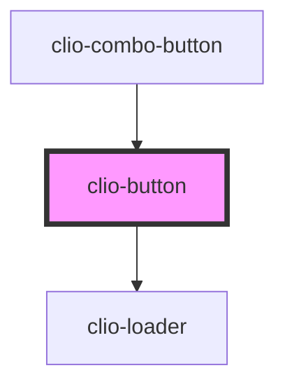

# clio-button

## Best practices
- Label content should fit onto one line
- Labels should be sentence case and fit onto one line.
- If there are any possibilities of ambiguity, include a noun in the button label to clarify the button action
- When a danger button is present, ensure that the tab index lands first on the safe action, before a destructive one

### Use primary buttons when:
- The action described by the button is the highest priority action in the layout
- An action is safe, and non-destructive

### Use secondary buttons when:
- An action is safe, and non-destructive
- Presenting users with two button actions of equal priority

### Use danger buttons when:
- An action is destructive and causes irreparable changes to user data

<!-- Auto Generated Below -->


## Usage

### Javascript

```html
<clio-button>Default</clio-button>
<clio-button button-style="primary">Primary</clio-button>
<clio-button button-style="secondary">Secondary</clio-button>
<clio-button button-style="danger">Danger</clio-button>
<clio-button disabled="true">Disabled</clio-button>
<clio-button href="http://google.com" target="_blank" rel="noopener">Linked Button</clio-button>
<clio-button loading="true">Loading</clio-button>
<clio-button size="small">Default - Small</clio-button>
<clio-button type="submit">Submit</clio-button>
<clio-button type="reset">Reset</clio-button>
```


### React

```tsx
import React from 'react';

import { ClioButton } from '@clio/nova-core-react';

export const ButtonExample: React.FC = () => (
  <ClioButton>Default</ClioButton>
  <ClioButton buttonStyle="primary">Primary</ClioButton>
  <ClioButton buttonStyle="secondary">Secondary</ClioButton>
  <ClioButton buttonStyle="danger">Danger</ClioButton>
  <ClioButton disabled="true">Disabled</ClioButton>
  <ClioButton href="http://google.com" target="_blank" rel="noopener">Linked Button</ClioButton>
  <ClioButton loading="true">Loading</ClioButton>
  <ClioButton size="small">Default - Small</ClioButton>
  <ClioButton type="submit">Submit</ClioButton>
  <ClioButton type="reset">Reset</ClioButton>
);

```


## Properties

| Property      | Attribute      | Description                                                                                                              | Type                                                        | Default       |
| ------------- | -------------- | ------------------------------------------------------------------------------------------------------------------------ | ----------------------------------------------------------- | ------------- |
| `buttonStyle` | `button-style` | This property defines the priority or role of a button.                                                                  | `"danger" or "primary" or "secondary"`                      | `"secondary"` |
| `disabled`    | `disabled`     | If true, the user cannot interact with the button.                                                                       | `boolean`                                                   | `false`       |
| `href`        | `href`         | The link that the user would like the button to lead to                                                                  | `string`                                                    | `undefined`   |
| `loading`     | `loading`      | If true, renders a loading state and the user cannot interact with the button.                                           | `boolean`                                                   | `false`       |
| `rel`         | `rel`          | The relationship between the current document and the linked document                                                    | `"noopener" or "noreferrer"`                                | `undefined`   |
| `size`        | `size`         | Defines the two available size formats for buttons. Set to `small` where space is at a premium, such as in a data table. | `"default" or "small"`                                      | `"default"`   |
| `target`      | `target`       | The specified target that the link will open in                                                                          | `"_blank" or "_parent" or "_self" or "_top" or "framename"` | `"_blank"`    |
| `type`        | `type`         | The type of the button.                                                                                                  | `"button" or "reset" or "submit"`                           | `"button"`    |


## Events

| Event       | Description                          | Type                |
| ----------- | ------------------------------------ | ------------------- |
| `clioBlur`  | Emitted when the button loses focus. | `CustomEvent<void>` |
| `clioFocus` | Emitted when the button has focus.   | `CustomEvent<void>` |


## CSS Custom Properties

| Name                                                 | Description                                                                                          |
| ---------------------------------------------------- | ---------------------------------------------------------------------------------------------------- |
| `--clio-button--danger-active-background-color`      | Danger button's background color when pressed. Defaults to #9a000e.                                  |
| `--clio-button--danger-active-border-color`          | Danger button's border color when pressed. Defaults to #9a000e.                                      |
| `--clio-button--danger-active-box-shadow`            | Danger button's inner shadow when pressed. Defaults to inset 0 1px 3px 0 #390006;                    |
| `--clio-button--danger-default-background-color`     | Danger button's default background color. Defaults to #e41b28.                                       |
| `--clio-button--danger-default-border-color`         | Danger button's default border color. Defaults to #a60110.                                           |
| `--clio-button--danger-default-color`                | Danger button's default text color. Defaults to global --white.                                      |
| `--clio-button--danger-default-gradient`             | Danger button's default gradient. Defaults to linear-gradient(-180deg, #fd3c49 0%, #ce111d 100%).    |
| `--clio-button--danger-disabled-background-color`    | Danger button's disabled background color. Defaults to #eb9197.                                      |
| `--clio-button--danger-disabled-border-color`        | Danger button's disabled border color. Defaults to #eb9197.                                          |
| `--clio-button--danger-disabled-color`               | Danger button's disabled text color. Defaults to global --white.                                     |
| `--clio-button--danger-hover-gradient`               | Danger button's hover gradient. Defaults to linear-gradient(-180deg, #d3131f 0%, #b6000c 100%).      |
| `--clio-button--primary-active-background-color`     | Primary button's background color when pressed. Default #0769b0.                                     |
| `--clio-button--primary-active-border-color`         | Primary button's border color when pressed. Default #0769b0.                                         |
| `--clio-button--primary-active-box-shadow`           | Primary button's inner shadow when pressed. Default inset 0 1px 3px 0 #004670.                       |
| `--clio-button--primary-default-background-color`    | Primary button's default background color. Defaults to #1f9efc.                                      |
| `--clio-button--primary-default-border-color`        | Primary button's default border color. Defaults to #1f9efc.                                          |
| `--clio-button--primary-default-color`               | Primary button's default text color. Defaults to Defaults to global --white.                         |
| `--clio-button--primary-default-gradient`            | Primary button's default gradient. Defaults to linear-gradient(-180deg, #4ab2fd 0%, #1e9efc 100%).   |
| `--clio-button--primary-disabled-background-color`   | Primary button's disabled background color. Defaults to #a0d3f9.                                     |
| `--clio-button--primary-disabled-border-color`       | Primary button's disabled border color. Defaults to #a0d3f9.                                         |
| `--clio-button--primary-disabled-color`              | Primary button's disabled text color. Defaults to global --white.                                    |
| `--clio-button--primary-hover-gradient`              | Primary button's hover gradient. Defaults to linear-gradient(-180deg, #2d9def 2%, #007dd9 100%).     |
| `--clio-button--secondary-active-background-color`   | Secondary button's background color when pressed. Defaults to #eceff1.                               |
| `--clio-button--secondary-active-border-color`       | Secondary button's border color when pressed. Defaults to #b0bec5.                                   |
| `--clio-button--secondary-active-box-shadow`         | Secondary button's inner shadow when pressed. Defaults to inset 0 1px 3px 0 rgba(38, 50, 56, 0.5).   |
| `--clio-button--secondary-default-background-color`  | Secondary button's default background color. Defaults to #f5f7f8.                                    |
| `--clio-button--secondary-default-border-color`      | Secondary button's default border color. Defaults to #b0bec5.                                        |
| `--clio-button--secondary-default-color`             | Secondary button's default text color. Defaults to #263238. Also applies on hover and press.         |
| `--clio-button--secondary-default-gradient`          | Secondary button's default gradient. Defaults to linear-gradient(-180deg, #ffffff 0%, #f5f7f8 100%). |
| `--clio-button--secondary-disabled-background-color` | Secondary button's disabled background color. Defaults to #f5f7f8.                                   |
| `--clio-button--secondary-disabled-border-color`     | Secondary button's disabled border color. Defaults to #d7dee2.                                       |
| `--clio-button--secondary-disabled-color`            | Secondary button's disabled text color. Defaults to global --white.                                  |
| `--clio-button--secondary-hover-gradient`            | Secondary button's hover gradient. Defaults to linear-gradient(-180deg, #f6f8f9 0%, #dfe6e9 100%).   |
| `--clio-button-border-radius`                        | Button border radius. Default 3px.                                                                   |
| `--clio-button-border-width`                         | Button border width. Default 1px.                                                                    |
| `--clio-button-font-family`                          | Button font family. Default global --font-family.                                                    |
| `--clio-button-font-size`                            | Button font size. Default global --font-size-body.                                                   |
| `--clio-button-host-display`                         | Display property for the host element. Defaults to inline-block.                                     |
| `--clio-button-loader-size`                          | The size of the loader that appears in the button loading state. Default 16px.                       |
| `--clio-button-padding-x`                            | Button's horizontal padding. Default global --spacing-m.                                             |
| `--clio-button-padding-x--small`                     | Small button's horizontal padding. Default global --spacing-s.                                       |
| `--clio-button-padding-y`                            | Button's vertical padding. Default global --spacing-s.                                               |
| `--clio-button-padding-y--small`                     | Small button's vertical padding. Default global --spacing-xs.                                        |
| `--clio-button-z-index`                              | Button's z-index. Defaults to auto.                                                                  |


## Dependencies

### Used by

 - [clio-combo-button](../combo-button)

### Depends on

- [clio-loader](../loader)

### Graph


----------------------------------------------

*Built with love!*
