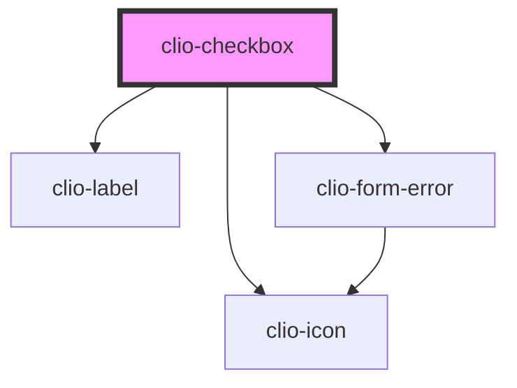

# clio-checkbox

<!-- Auto Generated Below -->

## Properties

| Property          | Attribute          | Description                                                                                                                                                                                                                                                             | Type               | Default     |
| ----------------- | ------------------ | ----------------------------------------------------------------------------------------------------------------------------------------------------------------------------------------------------------------------------------------------------------------------- | ------------------ | ----------- |
| `ariaDescribedby` | `aria-describedby` | The ID of the element that describes the checkbox.                                                                                                                                                                                                                      | `string`           | `undefined` |
| `ariaLabel`       | `aria-label`       | If no visible label is provided, use this to provide context for screen readers.                                                                                                                                                                                        | `string`           | `undefined` |
| `ariaLabelledby`  | `aria-labelledby`  | If a custom label element is being used, set this to the `id` of that label element to provide context for screen readers.                                                                                                                                              | `string`           | `undefined` |
| `checked`         | `checked`          | If true, the checkbox is checked.                                                                                                                                                                                                                                       | `boolean`          | `false`     |
| `disabled`        | `disabled`         | If true, the checkbox cannot be interacted with.                                                                                                                                                                                                                        | `boolean`          | `false`     |
| `indeterminate`   | `indeterminate`    | If true, the checkbox will visually appear as indeterminate.                                                                                                                                                                                                            | `boolean`          | `false`     |
| `label`           | `label`            | The label for the checkbox.                                                                                                                                                                                                                                             | `string`           | `undefined` |
| `name`            | `name`             | The name of the control, which is submitted with the form data.                                                                                                                                                                                                         | `string`           | `undefined` |
| `required`        | `required`         | If true, the checkbox is required.                                                                                                                                                                                                                                      | `boolean`          | `undefined` |
| `value`           | `value`            | The value of the toggle does not mean if it's checked or not, use the `checked` property for that.  The value of a toggle is analogous to the value of a `<input type="checkbox">`, it's only used when the toggle participates in a native `<form>`. Defaults to "on". | `number or string` | `undefined` |

## Events

| Event        | Description                           | Type                                 |
| ------------ | ------------------------------------- | ------------------------------------ |
| `clioChange` | Emitted when `checked` value changes. | `CustomEvent<{ checked: boolean; }>` |

## Methods

### `isValid() => Promise<boolean>`

Returns the validity state of the checkbox.

#### Returns

Type: `Promise<boolean>`

### `validate() => Promise<void>`

Forces the checkbox to validate.

#### Returns

Type: `Promise<void>`

## CSS Custom Properties

| Name                                             | Description                                                                                         |
| ------------------------------------------------ | --------------------------------------------------------------------------------------------------- |
| `--clio-checkbox-border-radius`                  | The border radius of the checkbox. Default `4px`.                                                   |
| `--clio-checkbox-border-width`                   | The border width of the checkbox. Default `1px`.                                                    |
| `--clio-checkbox-height`                         | The height of the checkbox. Default `16px`.                                                         |
| `--clio-checkbox-icon-active-background-color`   | The background color of the checkbox when it is in the "active" state. Default `--blue-link-500`.   |
| `--clio-checkbox-icon-disabled-background-color` | The background color of the checkbox icon when it is in the "disabled" state. Default `--grey-200`. |
| `--clio-checkbox-margin-bottom`                  | Radio margin bottom. Default var(--spacing-s).                                                      |
| `--clio-checkbox-margin-right`                   | The margin to the right of the checkbox. Default `0px`.                                             |
| `--clio-checkbox-unchecked-border-color`         | The border color of the checkbox when it is not checked. Default `--grey-400`.                      |
| `--clio-checkbox-width`                          | The width of the checkbox. Default `16px`.                                                          |

## Dependencies

### Depends on

- [clio-icon](../icon)
- [clio-label](../label)
- [clio-form-error](../form-error)

### Graph

----------------------------------------------

*Built with love!*
