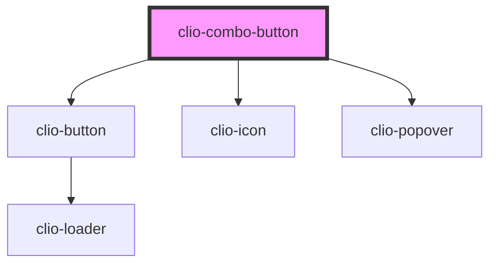

# clio-combo-button


<!-- Auto Generated Below -->


## Usage

### Javascript

```html
<clio-combo-button id="my-combo-button" primary-action-label="Default combo button">
  <clio-menu slot="parent-slot">
    <clio-menu-item onclick="console.log('One')">Example One</clio-menu-item>
    <clio-menu-item onclick="console.log('Two')">Example Two</clio-menu-item>
    <clio-menu-item onclick="console.log('Three')">Example Three</clio-menu-item>
  </clio-menu>
</clio-combo-button>
```

```javascript
const primaryButtonAction = () => {
  console.log("primaryButtonAction called !");
};
const comboButton = document.getElementById("my-combo-button");
comboButton.primaryActionClick = primaryButtonAction;
```


### React

```tsx
import React from 'react';

import { ClioComboButton } from '@clio/nova-core-react';

const menuItemData = [
  {
    id: 1,
    label: "Menu Item 1",
    onClick: () => { alert('menu item 1 clicked'); }
  },
  {
    id: 2,
    label: "Menu Item 2",
    onClick: () => { alert('menu item 2 clicked'); }
  }
];

const menuItems = menuItemData.map((menuItem) =>
  <ClioMenuItem key={menuItem.id} onClick={menuItem.onClick}>{menuItem.label}</ClioMenuItem>
);

const handlePrimaryActionClick = () => {
  alert("primary action clicked");
}

export const ComboButtonExample: React.FC = () => (
  <ClioComboButton primaryActionLabel="Default combo button" primaryActionClick={handlePrimaryActionClick}>
    <ClioMenu slot="parent-slot">{menuItems}</ClioMenu>
  </ClioComboButton>
);

```


## Properties

| Property             | Attribute              | Description                                                                                                                  | Type                                   | Default       |
| -------------------- | ---------------------- | ---------------------------------------------------------------------------------------------------------------------------- | -------------------------------------- | ------------- |
| `buttonStyle`        | `button-style`         | This property defines the priority or role of a button.                                                                      | `"danger" or "primary" or "secondary"` | `"secondary"` |
| `primaryActionClick` | --                     | The function that will handle the click event of the primary action button.                                                  | `Function`                             | `undefined`   |
| `primaryActionLabel` | `primary-action-label` | The text that will appear in the primary button.                                                                             | `string`                               | `undefined`   |
| `size`               | `size`                 | Defines the two available size formats for combo-buttons. Set to small where space is at a premium, such as in a data table. | `"default" or "small"`                 | `"default"`   |


## Dependencies

### Depends on

- [clio-button](../button)
- [clio-icon](../icon)
- [clio-popover](../popover)

### Graph


----------------------------------------------

*Built with love!*
