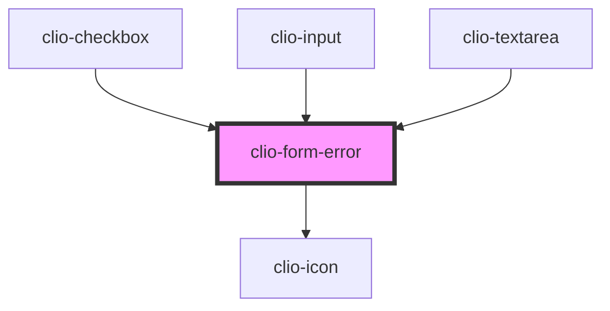

# clio-form-error

<!-- Auto Generated Below -->

## Properties

| Property  | Attribute | Description                                                            | Type     | Default     |
| --------- | --------- | ---------------------------------------------------------------------- | -------- | ----------- |
| `message` | `message` | A custom error message. Use this to override HTML5 validation message. | `string` | `undefined` |

## Dependencies

### Used by

 - [clio-checkbox](../checkbox)
 - [clio-input](../input)
 - [clio-textarea](../textarea)

### Depends on

- [clio-icon](../icon)

### Graph

----------------------------------------------

*Built with love!*
