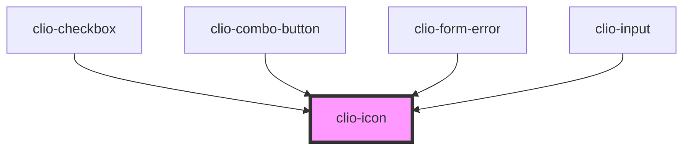

# clio-icon

<!-- Auto Generated Below -->

## Properties

| Property            | Attribute    | Description                                                                     | Type                                              | Default     |
| ------------------- | ------------ | ------------------------------------------------------------------------------- | ------------------------------------------------- | ----------- |
| `ariaLabel`         | `aria-label` | Used this to provide context for screen readers. Defaults to the icon name.     | `string`                                          | `undefined` |
| `color`             | `color`      | The color for the icon. Accepts hexidecimal, rgb(a), hsl(a), and string values. | `string`                                          | `"#000000"` |
| `name` _(required)_ | `name`       | The name of the icon to render.                                                 | `"caret-down" or "checkbox" or "dash" or "error"` | `undefined` |

## CSS Custom Properties

| Name                      | Description                          |
| ------------------------- | ------------------------------------ |
| `--icon-container-height` | Icon container height. Default 20px. |
| `--icon-container-width`  | Icon container width. Default 20px.  |

## Dependencies

### Used by

 - [clio-checkbox](../checkbox)
 - [clio-combo-button](../combo-button)
 - [clio-form-error](../form-error)
 - [clio-input](../input)

### Graph

----------------------------------------------

*Built with love!*
