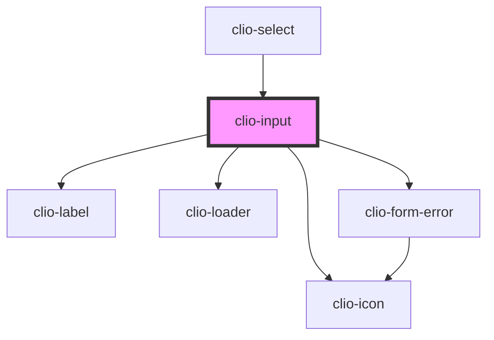

# clio-input

<!-- Auto Generated Below -->


## Usage

### Javascript

```html
<clio-input name="test" value="Initial Value"></clio-input>
<clio-input name="test2" placeholder="Placeholder"></clio-input>
<clio-input disabled="true"></clio-input>
<clio-input disabled="true" placeholder="Placeholder"></clio-input>
```


### React

```tsx
import React from 'react';

import { ClioInput } from '@clio/nova-core-react';

export const ButtonExample: React.FC = () => (
  <ClioInput name="test"></ClioInput>
  <ClioInput name="test" placeholder="Placeholder"></ClioInput>
  <ClioInput disabled="true"></ClioInput>
  <ClioInput disabled="true" placeholder="Placeholder"></ClioInput>
);

```


## Properties

| Property            | Attribute          | Description                                                                                                                        | Type                                                                                            | Default     |
| ------------------- | ------------------ | ---------------------------------------------------------------------------------------------------------------------------------- | ----------------------------------------------------------------------------------------------- | ----------- |
| `ariaDescribedby`   | `aria-describedby` | If a custom sub-label element is being used, set this to the `id` of that sub-label element to provide context for screen readers. | `string`                                                                                        | `undefined` |
| `ariaLabel`         | `aria-label`       | If no visible label is provided, use this to provide context for screen readers.                                                   | `string`                                                                                        | `undefined` |
| `ariaLabelledby`    | `aria-labelledby`  | If a custom label element is being used, set this to the `id` of that label element to provide context for screen readers.         | `string`                                                                                        | `undefined` |
| `autocomplete`      | `autocomplete`     | Indicates whether the value of the control can be automatically completed by the browser.                                          | `"off" or "on"`                                                                                 | `"on"`      |
| `autofocus`         | `autofocus`        | Specify that a form control should have input focus when the page loads.                                                           | `boolean`                                                                                       | `false`     |
| `disabled`          | `disabled`         | If true the input field cannot be interacted with.                                                                                 | `boolean`                                                                                       | `undefined` |
| `icon`              | `icon`             | Specifies the icon that is to be associated with the input.                                                                        | `"caret-down" or "checkbox" or "dash" or "error"`                                               | `undefined` |
| `label`             | `label`            | The label for the input.                                                                                                           | `string`                                                                                        | `undefined` |
| `loading`           | `loading`          | If true the input field will show a loading icon.                                                                                  | `boolean`                                                                                       | `false`     |
| `name` _(required)_ | `name`             | The name of the input, which is submitted with the form data.                                                                      | `string`                                                                                        | `undefined` |
| `placeholder`       | `placeholder`      | Instructional text that shows before the input has a value.                                                                        | `string`                                                                                        | `undefined` |
| `required`          | `required`         | If true the input field is required.                                                                                               | `boolean`                                                                                       | `undefined` |
| `subLabel`          | `sub-label`        | The sub-label for the input.                                                                                                       | `string`                                                                                        | `undefined` |
| `suffix`            | `suffix`           | Provides additional context to the user, (ex. “$” or “$/hr”).                                                                      | `string`                                                                                        | `undefined` |
| `type`              | `type`             | The type of input field to display.                                                                                                | `"date" or "email" or "number" or "password" or "search" or "tel" or "text" or "time" or "url"` | `"text"`    |
| `validationRules`   | --                 | An array of validation rules can be passed in to provide validation checking.                                                      | `ValidationRule[]`                                                                              | `undefined` |
| `value`             | `value`            | Specifies the value of the element                                                                                                 | `string`                                                                                        | `undefined` |


## Events

| Event                    | Description                            | Type                |
| ------------------------ | -------------------------------------- | ------------------- |
| `clioBlur`               | Emitted when the input loses focus.    | `CustomEvent<void>` |
| `clioInputEnterKeyPress` | Emitted when the enter key is pressed. | `CustomEvent<any>`  |


## Methods

### `getIconElement() => Promise<HTMLElement>`

A method that returns the input's icon element.

#### Returns

Type: `Promise<HTMLElement>`


### `isDirty() => Promise<boolean>`

Returns the dirty state of the input.

#### Returns

Type: `Promise<boolean>`


### `isValid() => Promise<boolean>`

Returns the validity state of the input.

#### Returns

Type: `Promise<boolean>`


### `setDirty(dirty: boolean) => Promise<void>`

Manually sets the dirty state of the input.

#### Returns

Type: `Promise<void>`


### `setFocus() => Promise<void>`

Sets focus on the specified `clio-input`. Use this method instead of the global
`input.focus()`.

#### Returns

Type: `Promise<void>`


### `validate() => Promise<void>`

Forces the input to validate. It calls handleValidity() and passes an optional `force` boolean.

#### Returns

Type: `Promise<void>`


## CSS Custom Properties

| Name                                 | Description                                                                    |
| ------------------------------------ | ------------------------------------------------------------------------------ |
| `--input--default-background-color`  | The background color of a default input. Default `--white`.                    |
| `--input--default-border-color`      | The border color of a default input. Default `--border-color-dark`.            |
| `--input--disabled-background-color` | The background color of a disabled input. Default `--grey-100`.                |
| `--input--disabled-color`            | The text color of a disabled input. Default `--grey-400`.                      |
| `--input--error-border-color`        | The border color of an input with an error. Default `--red-500`.               |
| `--input--suffix-background-color`   | The background color of the suffix element. Default `#f5f7f8`.                 |
| `--input--suffix-color`              | The color of the suffix element. Default `--grey-500`.                         |
| `--input-padding-x`                  | The padding applied to the left and right of the input. Default `--spacing-m`. |
| `--input-padding-y`                  | The padding applied to the top and bottom of the input. Default `--spacing-s`. |
| `--input-placeholder-color`          | The color of the input's placeholder text. Default `--grey-400`.               |


## Dependencies

### Used by

 - [clio-select](../select)

### Depends on

- [clio-label](../label)
- [clio-loader](../loader)
- [clio-icon](../icon)
- [clio-form-error](../form-error)

### Graph


----------------------------------------------

*Built with love!*
