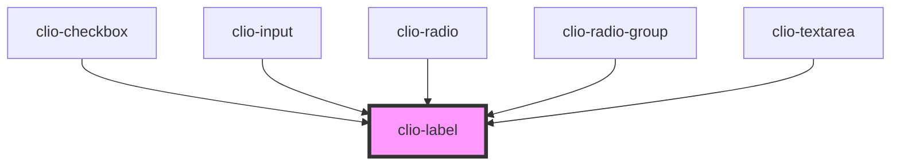

# clio-label


<!-- Auto Generated Below -->


## Usage

### Javascript

```html
<clio-label>Default</clio-label>
<clio-label label-type="required">With Required Indicator</clio-label>
```


### React

```tsx
import React from 'react';

import { ClioLabel } from '@clio/nova-core-react';

export const ButtonExample: React.FC = () => (
  <ClioLabel>Default</ClioLabel>
  <ClioLabel labelType="required">With Required Indicator</ClioLabel>
);

```


## Properties

| Property    | Attribute    | Description                                                                 | Type                                     | Default     |
| ----------- | ------------ | --------------------------------------------------------------------------- | ---------------------------------------- | ----------- |
| `for`       | `for`        | The id value of the input that the label is associated with.                | `string`                                 | `undefined` |
| `labelType` | `label-type` | The type of label. Allows a label to use the required or sub-label styling. | `"default" or "required" or "sub-label"` | `"default"` |


## CSS Custom Properties

| Name                     | Description                                                         |
| ------------------------ | ------------------------------------------------------------------- |
| `--label-color`          | Text colour for the label. Defaults to Defaults to global --black.  |
| `--label-font-size`      | Font size for the sub-label. Defaults to global --font-size-body.   |
| `--label-font-weight`    | Font weight for the label. Defaults to global --font-weight-bold.   |
| `--label-line-height`    | Line height for the sub-label. Defaults to global --line-height.    |
| `--label-margin`         | Margin for the label. Defaults to 0.                                |
| `--label-required-color` | Text colour for the required label. Defaults to global --green-500. |


## Dependencies

### Used by

 - [clio-checkbox](../checkbox)
 - [clio-input](../input)
 - [clio-radio](../radio)
 - [clio-radio-group](../radio-group)
 - [clio-textarea](../textarea)

### Graph


----------------------------------------------

*Built with love!*
