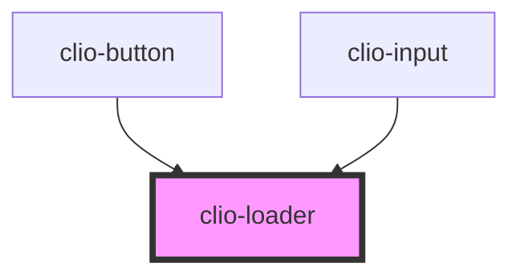

# clio-loader

<!-- Auto Generated Below -->


## Usage

### Javascript

```html
<clio-loader></clio-loader>
<clio-loader size="small"></clio-loader>
<clio-loader loader-style="reversed"></clio-loader>
<clio-loader loader-style="reversed" size="small"></clio-loader>
```


### React

```tsx
import React from 'react';

import { ClioLoader } from '@clio/nova-core-react';

export const LoaderExample: React.FC = () => (
  <ClioLoader />
  <ClioLoader size="small" />
  <ClioLoader loaderStyle="reversed" />
  <ClioLoader size="small" loaderStyle="reversed" />
);

```


## Properties

| Property      | Attribute      | Description                                       | Type                      | Default                |
| ------------- | -------------- | ------------------------------------------------- | ------------------------- | ---------------------- |
| `ariaLabel`   | `aria-label`   | Labels the form for screen readers.               | `string`                  | `"Content is loading"` |
| `loaderStyle` | `loader-style` | Sets the loader to "default" or "reversed" style. | `"default" or "reversed"` | `"default"`            |
| `size`        | `size`         | Sets the size of Sets the size of the loader.     | `"large" or "small"`      | `"large"`              |


## CSS Custom Properties

| Name                                    | Description                                                                                                                                                                                   |
| --------------------------------------- | --------------------------------------------------------------------------------------------------------------------------------------------------------------------------------------------- |
| `--loader--large`                       | The size of the container div for the loader, large is the default size. Defaults to 32px.                                                                                                    |
| `--loader--small`                       | The size of the container div for the loader if the `size` prop is set to "small". Defaults to 16px.                                                                                          |
| `--loader-color`                        | The colour of the animated stroke in loader, --blue-link-500 is the default colour. Defaults to --blue-link-500.                                                                              |
| `--loader-color--reversed`              | The colour of the animated stroke in loader if the `loaderStyle` prop is set to "reversed". Defaults to --white.                                                                              |
| `--loader-stroke-width--large`          | The stroke-width of the animated stoke around the circle in loader, large is the default size. Defaults to 13.5%.                                                                             |
| `--loader-stroke-width--small`          | The stroke-width of the animated stroke in loader if the`size` prop is set to "small". Defaults to 20%.                                                                                       |
| `--loader-svg-path--dash-gap`           | The size of the gap between dashes in a stroke. Defaults to 200px.                                                                                                                            |
| `--loader-svg-path--dash-length-middle` | The "stroke-dasharray" property draws a stroke around the outside of the svg circle. A value of 125px would draw the line completely around the circle. Defaults to 90px to give a "C" shape. |
| `--loader-svg-path--dash-length-start`  | Changing the length of the stroke during the "dash" keyframe animation means a longer line will be drawn. Must always be a value >=125px. Defaults to 1px.                                    |
| `--loader-svg-path--offset-end`         | Here "stroke-offset" controls where the stroke appears to end. Animating it gives the impression that the end of the line is chasing the beginning. Defaults to -125px.                       |
| `--loader-svg-path--offset-middle`      | A value of -35px moves the end of the stroke 35 pixels clockwise on the path of the circular svg. Defaults to -35px.                                                                          |


## Dependencies

### Used by

 - [clio-button](../button)
 - [clio-input](../input)

### Graph


----------------------------------------------

*Built with love!*
