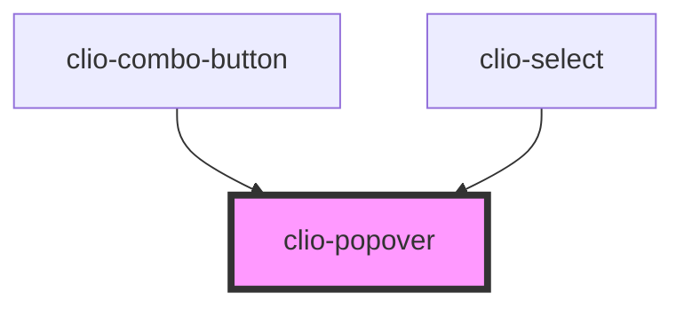

# clio-popover


<!-- Auto Generated Below -->


## Usage

### Javascript

```html
<clio-button id="menu-popover-activator" onclick="handlePopoverActivatorClick('menu-popover')">
  Click to see menu items
</clio-button>
<clio-popover id="menu-popover" active="true" align-x="left" align-y="bottom" padding="xs">
  <div slot="content">
    <clio-menu>
      <clio-menu-item onclick="alert('Triggered')">Apple</clio-menu-item>
      <clio-menu-item onclick="alert('Triggered')">Ball</clio-menu-item>
      <clio-menu-item onclick="alert('Triggered')">Cat</clio-menu-item>
    </clio-menu>
  </div>
</clio-popover>
```

```javascript
const handlePopoverActivatorClick = popoverId => {
  const popover = document.getElementById(popoverId);
  popover.active = !popover.active;
};

const initializePopover = () => {
  window.onload = () => {
    const popover = document.getElementById("menu-popover");
    const activator = document.getElementById("menu-popover-activator");
    popover.activator = activator;
  };
};

initializePopover();
```


## Properties

| Property                 | Attribute   | Description                                                                                                                             | Type                                          | Default     |
| ------------------------ | ----------- | --------------------------------------------------------------------------------------------------------------------------------------- | --------------------------------------------- | ----------- |
| `activator` _(required)_ | --          | This is the element that should control the popover's active state and which the popover is position relative to. Ex. a `<clio-button>` | `HTMLElement`                                 | `undefined` |
| `active`                 | `active`    | This determines whether the popover is visible or not.                                                                                  | `boolean`                                     | `false`     |
| `alignX`                 | `align-x`   | This determines the horizontal alignment of the popover relative to its activator.                                                      | `"left" or "middle" or "right"`               | `"left"`    |
| `alignY`                 | `align-y`   | This determines the vertical alignment of the popover relative to its activator.                                                        | `"bottom" or "middle" or "top"`               | `"top"`     |
| `autofocus`              | `autofocus` | This determines whether the popover should attempt to automatically find and focus on content. Defaults to `true`.                      | `boolean`                                     | `true`      |
| `padding`                | `padding`   | This determines how much padding is applied to the popover content container.                                                           | `"l" or "m" or "none" or "s" or "xl" or "xs"` | `"l"`       |
| `role`                   | `role`      | The role of the popover.                                                                                                                | `string`                                      | `"dialog"`  |


## Events

| Event                          | Description                                      | Type               |
| ------------------------------ | ------------------------------------------------ | ------------------ |
| `clioPopoverVisibilityToggled` | Emitted when the popover visisbility is toggled. | `CustomEvent<any>` |


## Slots

| Slot        | Description                               |
| ----------- | ----------------------------------------- |
| `"content"` | Popover content goes inside of this slot. |


## CSS Custom Properties

| Name                      | Description                                                               |
| ------------------------- | ------------------------------------------------------------------------- |
| `--popover-background`    | The popover background color. Defaults to --white.                        |
| `--popover-border-radius` | The popover border radius. Defaults to 4px.                               |
| `--popover-box-shadow`    | The popover's box shadow. Defaults to 0px 20px 30px rgba(0, 28, 55, 0.2). |
| `--popover-max-width`     | The popover's maximum width. Defaults to 400px.                           |


## Dependencies

### Used by

 - [clio-combo-button](../combo-button)
 - [clio-select](../select)

### Graph


----------------------------------------------

*Built with love!*
