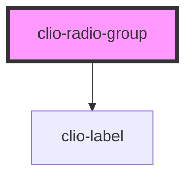

# clio-radio-group

<!-- Auto Generated Below -->

## Properties

| Property | Attribute | Description                                                         | Type     | Default     |
| -------- | --------- | ------------------------------------------------------------------- | -------- | ----------- |
| `label`  | `label`   | The label for the radio group.                                      | `string` | `undefined` |
| `name`   | `name`    | The name of the radio group, which is submitted with the form data. | `string` | `undefined` |
| `value`  | `value`   | The value of the radio group.                                       | `any`    | `undefined` |

## Events

| Event        | Description                         | Type                              |
| ------------ | ----------------------------------- | --------------------------------- |
| `clioChange` | Emitted when the value has changed. | `CustomEvent<{ value: string; }>` |

## Dependencies

### Depends on

- [clio-label](../label)

### Graph

----------------------------------------------

*Built with love!*
