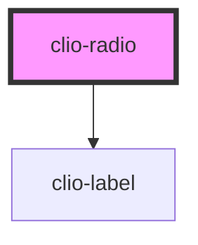

# clio-radio

<!-- Auto Generated Below -->


## Usage

### Javascript

```html
<clio-radio aria-describedby="something" name="group1" value="000">Option 1</clio-radio>
<clio-radio name="group1" value="111">Option 2</clio-radio>
<clio-radio name="group1" value="222">Option 3</clio-radio>
<clio-radio name="group1" value="333" disabled="true">Option 4</clio-radio>
```


### React

```tsx
import React from 'react';

import { ClioRadio } from '@clio/nova-core-react';

export const RadioInputExample: React.FC = () => (
  <ClioRadio name="group1" value="111" ariaDescribedby="something">Option 1</ClioRadio>
  <ClioRadio name="group1" value="222">Option 2</ClioRadio>
  <ClioRadio name="group1" disabled="true" value="333">Option 3</ClioRadio>
);

```


## Properties

| Property          | Attribute          | Description                                                                                                                        | Type      | Default     |
| ----------------- | ------------------ | ---------------------------------------------------------------------------------------------------------------------------------- | --------- | ----------- |
| `ariaDescribedby` | `aria-describedby` | If a custom sub-label element is being used, set this to the `id` of that sub-label element to provide context for screen readers. | `string`  | `undefined` |
| `ariaLabel`       | `aria-label`       | If no visible label is provided, use this to provide context for screen readers.                                                   | `string`  | `undefined` |
| `ariaLabelledby`  | `aria-labelledby`  | If a custom label element is being used, set this to the `id` of that label element to provide context for screen readers.         | `string`  | `undefined` |
| `disabled`        | `disabled`         | If true, radio cannot be interacted with.                                                                                          | `boolean` | `false`     |
| `label`           | `label`            | The label for the radio.                                                                                                           | `string`  | `undefined` |
| `name`            | `name`             | The name of the control, which is submitted with the form data.                                                                    | `string`  | `undefined` |
| `value`           | `value`            | The value of the radio.                                                                                                            | `any`     | `undefined` |


## CSS Custom Properties

| Name                               | Description                                                                                          |
| ---------------------------------- | ---------------------------------------------------------------------------------------------------- |
| `--radio-border-style`             | Radio border style. Default solid.                                                                   |
| `--radio-border-width`             | Radio border width. Default 1px.                                                                     |
| `--radio-checked-background-color` | Background color for selected radio. Default #0070E0.                                                |
| `--radio-checked-border-color`     | Border color for selected radio. Default #0070E0.                                                    |
| `--radio-circle-background`        | Background color for inner circle in radio. Default #FFFFFF.                                         |
| `--radio-circle-dimensions`        | Dimensions for inner circle in radio. Default 6px.                                                   |
| `--radio-default-background-color` | Radio background color. Default #FFFFFF.                                                             |
| `--radio-default-border-color`     | Radio border color. Default #90A6BC.                                                                 |
| `--radio-dimensions`               | The width/height for the radio. Default 16px.                                                        |
| `--radio-margin-bottom`            | Radio margin bottom. Default var(--spacing-s).                                                       |
| `--radio-margin-right`             | Radio margin right. Default 0.                                                                       |
| `--radio-text-padding`             | Padding between radio and related text. Default calc(var(--radio-default-width) + var(--spacing-s)). |


## Dependencies

### Depends on

- [clio-label](../label)

### Graph


----------------------------------------------

*Built with love!*
