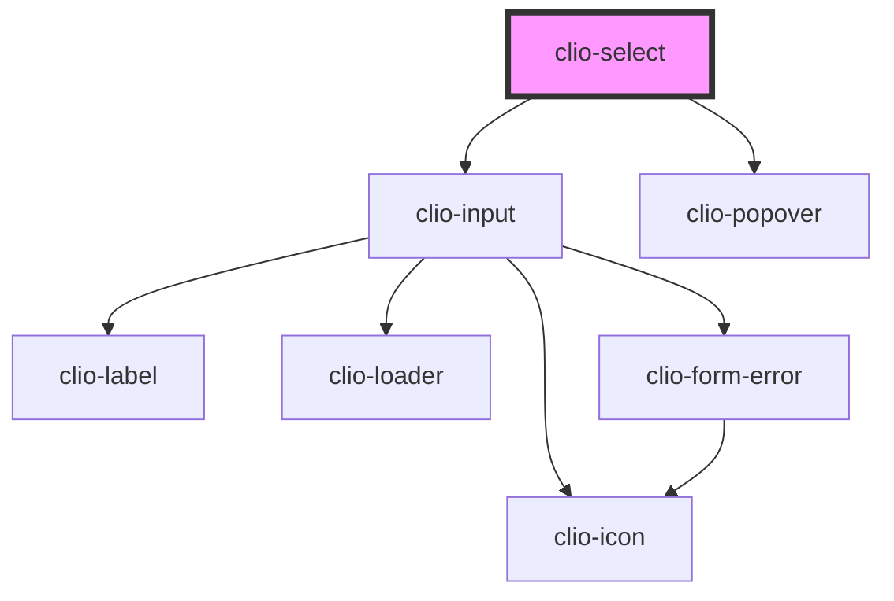

# clio-select

<!-- Auto Generated Below -->

## Properties

| Property          | Attribute          | Description                                                                                                                        | Type                                            | Default     |
| ----------------- | ------------------ | ---------------------------------------------------------------------------------------------------------------------------------- | ----------------------------------------------- | ----------- |
| `ariaDescribedby` | `aria-describedby` | If a custom sub-label element is being used, set this to the `id` of that sub-label element to provide context for screen readers. | `string`                                        | `undefined` |
| `ariaLabel`       | `aria-label`       | If no visible label is provided, use this to provide context for screen readers.                                                   | `string`                                        | `undefined` |
| `ariaLabelledby`  | `aria-labelledby`  | If a custom label element is being used, set this to the `id` of that label element to provide context for screen readers.         | `string`                                        | `undefined` |
| `autofocus`       | `autofocus`        | Sets whether this element will receive focus when it is rendered.                                                                  | `boolean`                                       | `false`     |
| `items`           | --                 | The items that will be displayed as `<clio-menu-item>`s within a `<clio-popover>`.                                                 | `{ label: string; value: string or number; }[]` | `undefined` |
| `label`           | `label`            | The label for the input.                                                                                                           | `string`                                        | `undefined` |
| `loading`         | `loading`          | If true, a loading spinner is displayed within the text input.                                                                     | `boolean`                                       | `false`     |
| `name`            | `name`             | The name of the control, which is submitted with the form data.                                                                    | `string`                                        | `undefined` |
| `required`        | `required`         | If true, this field is required.                                                                                                   | `boolean`                                       | `false`     |
| `subLabel`        | `sub-label`        | The sub-label for the input.                                                                                                       | `string`                                        | `undefined` |
| `value`           | `value`            | The value of the item that is currently selected. This can be used to set an initial value as well.                                | `number or string`                              | `undefined` |

## Events

| Event              | Description                              | Type                                                       |
| ------------------ | ---------------------------------------- | ---------------------------------------------------------- |
| `clioInput`        | Emitted when `clio-input` value changes. | `CustomEvent<{ value: string; }>`                          |
| `clioItemSelected` | Emitted when the selected value changes. | `CustomEvent<{ label: string; value: string or number; }>` |

## Methods

### `isDirty() => Promise<boolean>`

Returns the dirty state of the select.

#### Returns

Type: `Promise<boolean>`

### `isValid() => Promise<boolean>`

Returns the validity state of the select.

#### Returns

Type: `Promise<boolean>`

### `setDirty(dirty: boolean) => Promise<void>`

Manually sets the dirty state of the select.

#### Returns

Type: `Promise<void>`

### `setFocus() => Promise<void>`

Sets focus on the input element.

#### Returns

Type: `Promise<void>`

### `validate() => Promise<void>`

Forces the select to validate. It calls the Input's validate() method.

#### Returns

Type: `Promise<void>`

## CSS Custom Properties

| Name                                               | Description                                                                              |
| -------------------------------------------------- | ---------------------------------------------------------------------------------------- |
| `--select__popover__item-default-background-color` | The menu item's background color in the default state. Defaults to global --white.       |
| `--select__popover__item-default-color`            | The menu item's text color in the default state. Defaults to global --grey-700.          |
| `--select__popover__item-hover-background-color`   | The menu item's background color in the hover state. Defaults to global --blue-link-500. |
| `--select__popover__item-hover-color`              | The menu item's text color in the hover state. Defaults to global -- white.              |
| `--select__popover__item-padding-x`                | The menu item's horizontal padding. Defaults to global --spacing-m.                      |
| `--select__popover__item-padding-y`                | The menu item's vertical padding. Defaults to global --spacing-s.                        |

## Dependencies

### Depends on

- [clio-input](../input)
- [clio-popover](../popover)

### Graph

----------------------------------------------

*Built with love!*
