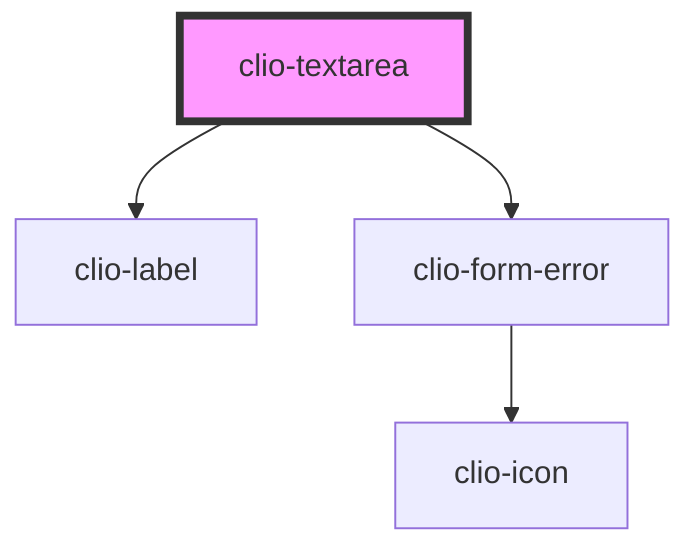

# clio-textarea

<!-- Auto Generated Below -->


## Usage

### Javascript

```html
<clio-textarea name="test" value="some value"></clio-textarea>
```


### React

```tsx
import React from 'react';

import { ClioTextarea } from '@clio/nova-core-react';

export const TextareaExample: React.FC = () => (
  <ClioTextarea name="test"></ClioTextarea>
);

```


## Properties

| Property            | Attribute          | Description                                                                     | Type      | Default     |
| ------------------- | ------------------ | ------------------------------------------------------------------------------- | --------- | ----------- |
| `ariaDescribedby`   | `aria-describedby` | If no sub-label is provided, use this to provide context for screen readers.    | `string`  | `undefined` |
| `ariaLabel`         | `aria-label`       | If no label is provided, use this to provide context for screen readers.        | `string`  | `undefined` |
| `ariaLabelledby`    | `aria-labelledby`  | If no label is provided, use this to provide context for screen readers.        | `string`  | `undefined` |
| `autofocus`         | `autofocus`        | Specify that a form control should give the textarea focus when the page loads. | `boolean` | `false`     |
| `disabled`          | `disabled`         | If true, the textarea will be disabled.                                         | `boolean` | `undefined` |
| `label`             | `label`            | The label for the input.                                                        | `string`  | `undefined` |
| `name` _(required)_ | `name`             | The name of the textarea, which is submitted with the form data.                | `string`  | `undefined` |
| `placeholder`       | `placeholder`      | Instructional text that shows before the textarea has a value.                  | `string`  | `undefined` |
| `required`          | `required`         | If true, the textarea is required.                                              | `boolean` | `undefined` |
| `subLabel`          | `sub-label`        | The sub-label for the input.                                                    | `string`  | `undefined` |
| `value`             | `value`            | Specifies the value of the element.                                             | `string`  | `undefined` |


## Methods

### `isDirty() => Promise<boolean>`

Returns the dirty state of the textarea.

#### Returns

Type: `Promise<boolean>`


### `isValid() => Promise<boolean>`

Returns the validity state of the textarea.

#### Returns

Type: `Promise<boolean>`


### `setDirty(dirty: boolean) => Promise<void>`

Manually sets the dirty state of the textarea.

#### Returns

Type: `Promise<void>`


### `setFocus() => Promise<void>`

Sets focus on the specified `clio-textarea`. Use this method instead of the global
`textarea.focus()`.

#### Returns

Type: `Promise<void>`


### `validate() => Promise<boolean>`

Forces the textarea to validate. Returns `true` if the textarea is valid.

#### Returns

Type: `Promise<boolean>`


## CSS Custom Properties

| Name                                    | Description                                                                |
| --------------------------------------- | -------------------------------------------------------------------------- |
| `--textarea--default-background-color`  | Background color of the textarea. Defaults to global --white.              |
| `--textarea--default-border-color`      | Color of the textarea's border. Defaults to global --border-color-dark.    |
| `--textarea--default-border-radius`     | Border radius of the textarea. Defaults to 2px.                            |
| `--textarea--disabled-background-color` | Background color of a disabled textarea. Defaults to global --grey-100.    |
| `--textarea--disabled-color`            | Font color of a disabled textarea. Defaults to global --grey-400.          |
| `--textarea-padding-x`                  | Left/right padding of the textarea. Defaults to global --spacing-xs.       |
| `--textarea-padding-y`                  | Top/bottom padding of the textarea. Defaults to global --spacing-xs.       |
| `--textarea-placeholder-color`          | Font colour of a textarea placeholder. Defaults to global --grey-400.      |
| `--textarea__error-border-color`        | Border color of an error-state textarea. Defaults to global --red-500.     |
| `--textarea__error-box-shadow`          | Box shadow of an error-state textarea. Defaults: 0 0 0 1px var(--red-500). |


## Dependencies

### Depends on

- [clio-label](../label)
- [clio-form-error](../form-error)

### Graph


----------------------------------------------

*Built with love!*
